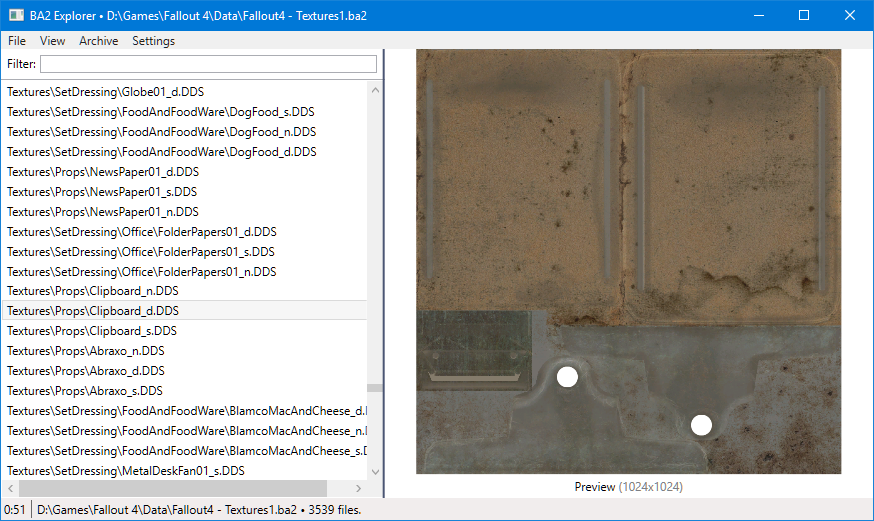

# BA2 Explorer
Tool to explore BA2 archives.

## Releases
Currently you have to compile source yourself to get binary, you'll need only VS 2015 to compile. Open VS solution and hit "build" button and everything is done.

## Credits
* DDS image loader by https://github.com/soeminnminn